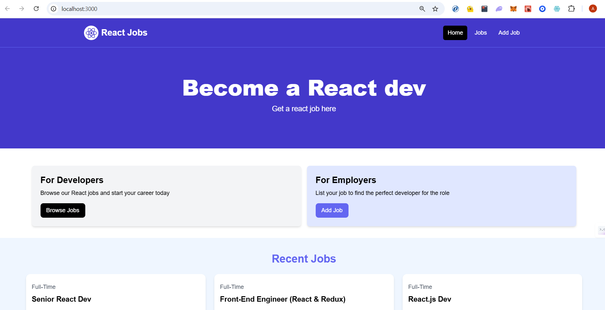
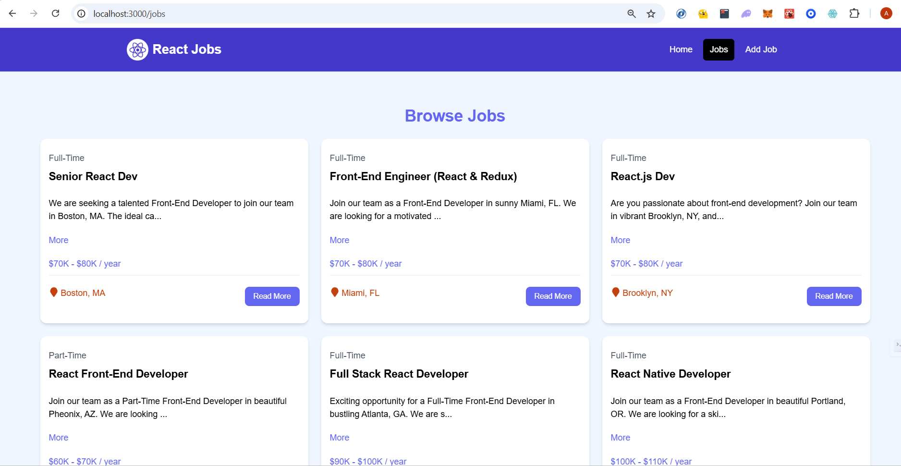
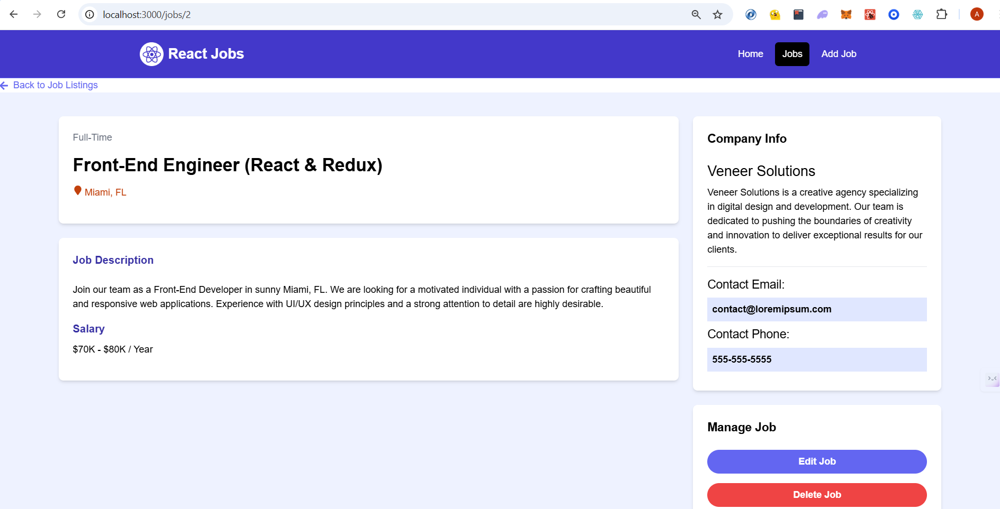
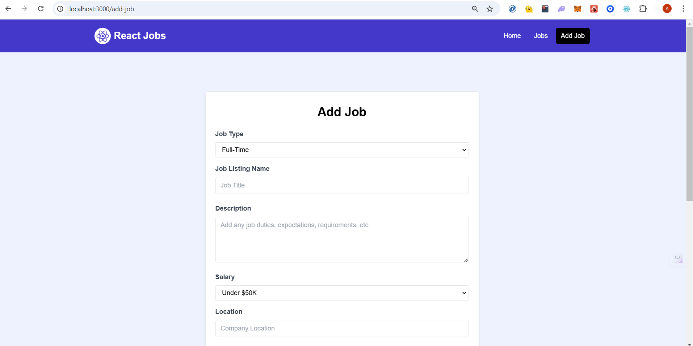

# React Jobs App Project

This is the React Jobs CRUD App frontend project where I have used a mock backend using JSON-server.

# Run the project

1. `git clone https://github.com/Akshat-cs/React-Jobs-App-Frontend`

2. `cd <project-directory>`

3. `npm install`

4. Run `npm run dev` on one terminal

5. Run `npm run server` on another terminal

6. You are good to go. Enjoy!

# Project Screenshots

## Home Page

## Browse Jobs Page

## Specific Job Page

## Add Job Page

